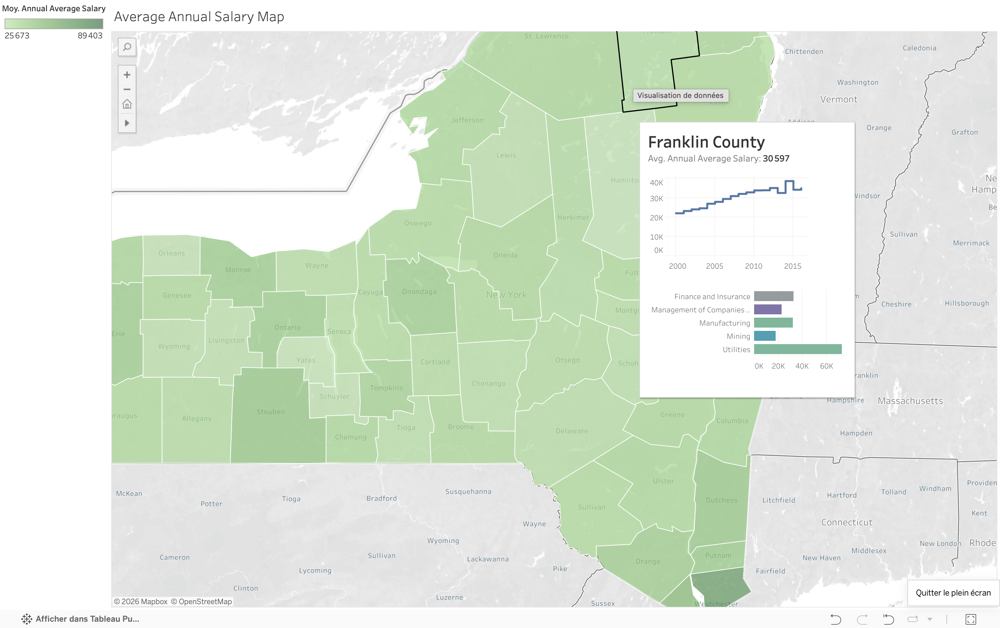

# NY State Salary Analysis

## Contexte métier
Un client souhaite analyser les salaires moyens par secteur d'activité 
dans l'État de New York. Contrainte explicite : pas de dashboard, 
pas de sheets séparées - tout doit tenir sur une seule feuille, 
avec des graphiques accessibles au survol de la carte.

## Problématiques
1. Quelle est la distribution des salaires annuels moyens par county ?
2. Quels sont les 5 secteurs les mieux rémunérés par county ?
3. Quelle est l'évolution du salaire annuel moyen par county dans le temps ?

## Démarche
- Carte choroplèthe des salaires moyens par county
- Intégration de worksheets directement dans les tooltips :
  - Série temporelle de l'évolution salariale
  - Top 5 des secteurs les mieux rémunérés
- Tout contenu accessible depuis une seule sheet sans dashboard

## Compétences mobilisées
- Tooltips enrichis avec worksheets intégrées
- Cartographie choroplèthe (carte où les zones sont colorées selon une valeur - comme ici, plus le salaire est élevé, plus le county est foncé)
- Série temporelle
- Visualisation multi-niveaux sur une seule sheet

## Visualisation

🔗 [Voir sur Tableau Public](https://public.tableau.com/views/NYStateSalaryAnalysis_17729449807290/AverageAnnualSalaryMap)

## Outils
- Tableau Public

## Données
Jeu de données fictif (exercice pédagogique).
